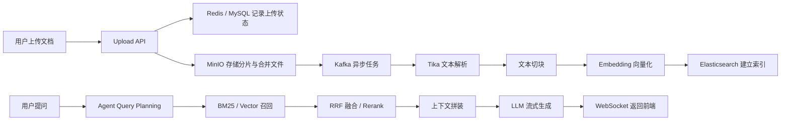

# 高可用RAG知识引擎

本项目是一个面向企业知识场景的 RAG 知识库系统，提供文档上传、异步解析、向量化索引、混合检索、智能问答、Agent 编排和多租户权限控制能力。

项目围绕一条完整的知识处理链路展开：文件进入系统后，先完成分片上传与校验，再进入异步处理流水线完成文本抽取、切块、向量化和索引，最终通过检索增强生成能力为用户提供带上下文的智能问答体验。


## 核心功能

| 模块 | 功能说明 |
| --- | --- |
| 文档上传 | 支持分片上传、MD5 校验、断点续传、秒传、文件合并 |
| 文档处理 | 基于 Tika 提取文档内容，完成文本清洗、切块和向量化 |
| 异步流水线 | 使用 Kafka 解耦上传、解析、切块、Embedding、索引流程 |
| 检索能力 | 支持 BM25、向量召回、RRF 融合、短语兜底和可选 Rerank |
| 智能问答 | 基于检索结果拼装上下文，通过 WebSocket 流式返回回答 |
| Agent 编排 | 对问题做意图识别、问题改写、追问识别、检索模式选择 |
| 多租户权限 | 支持组织标签 `org_tag`、公开文档、私有文档访问控制 |
| 后台管理 | 支持用户管理、组织标签管理、文档管理、会话查看和任务重放 |

## Agent 能力

项目中的 Agent 不是独立聊天入口，而是接入在问答链路前的一个轻量编排层，用来提升检索和回答的相关性。

- 对用户问题做意图分类，区分单跳问答、追问、对比、排障和闲聊
- 对原始问题进行改写，去掉口语化前缀，生成更适合检索的查询语句
- 判断当前问题是否依赖历史上下文，决定是否带入多轮会话
- 根据问题类型选择检索模式，例如排障问题更偏 BM25，对比类问题启用更完整的混合检索
- 在闲聊场景下可跳过检索，避免无效召回
- 支持通过 OpenAI 兼容接口或本地 Ollama 作为 Agent 模型来源

## 系统流程



## 功能特点

- 上传链路具备幂等性，已上传分片可跳过重复传输
- 文件合并后自动触发异步处理，不阻塞上传请求
- 检索阶段支持并行召回与降级策略，兼顾召回率与稳定性
- 权限过滤下沉到检索层，避免无权限内容进入回答上下文
- WebSocket 输出适合长回答和流式对话场景
- Agent 参与查询规划，让多轮追问和复杂问题有更稳定的检索入口

## 支持的文档类型

- PDF
- DOC / DOCX
- XLS / XLSX
- PPT / PPTX
- TXT
- Markdown

## 技术栈

- 后端：Go 1.23, Gin, GORM, Zap, JWT
- 前端：Vue 3, TypeScript, Vite, Pinia, Vue Router, Naive UI, UnoCSS
- 数据与中间件：MySQL 8.0, Redis 7.0, Kafka, MinIO, Elasticsearch 8
- AI 能力：DeepSeek / Ollama, DashScope Embedding, Apache Tika, Reranker

## 项目结构

```text
cmd/
  server/                    后端启动入口

internal/
  config/                    配置管理
  handler/                   HTTP / WebSocket 接口层
  middleware/                鉴权、日志、管理员校验
  model/                     领域模型与 DTO
  pipeline/                  文档异步处理逻辑
  repository/                数据访问层
  service/                   业务逻辑层

pkg/
  agent/                     Agent 客户端
  database/                  MySQL / Redis 初始化
  embedding/                 Embedding 客户端
  es/                        Elasticsearch 客户端
  kafka/                     Kafka Producer / Consumer
  llm/                       LLM 客户端
  reranker/                  Reranker 客户端
  storage/                   MinIO 客户端
  tika/                      Tika 客户端
  token/                     JWT 管理

frontend/
  src/assets/                静态资源
  src/components/            通用组件
  src/layouts/               布局
  src/router/                路由配置
  src/service/               前端 API 封装
  src/store/                 状态管理
  src/views/                 登录、知识库、聊天、用户管理、组织标签等页面

docs/
  ddl.sql                    数据库建表脚本
  rag-platform-isometric.svg 架构图
```

## 主要页面

- 登录 / 注册
- 知识库管理
- 文档上传与检索
- 智能问答聊天页
- 聊天历史
- 用户管理
- 组织标签管理
- 个人中心

## 本地启动

### 1. 环境要求

- Go 1.23+
- Node.js 18.20+
- pnpm 8.7+
- Docker / Docker Compose

### 2. 启动基础依赖

```bash
docker compose -f deployments/docker-compose.yaml up -d
```

默认会启动：

- MySQL
- Redis
- MinIO
- Elasticsearch
- Kafka
- Zookeeper
- Apache Tika

### 3. 配置服务

编辑 `configs/config.yaml`，按实际环境填写以下配置：

- MySQL
- Redis
- MinIO
- Elasticsearch
- Kafka
- Tika
- Embedding 服务
- LLM 服务
- Agent 服务
- Reranker 服务

### 4. 启动后端

```bash
go mod download
go run cmd/server/main.go
```

默认端口：

```text
http://127.0.0.1:8081
```

### 5. 启动前端

```bash
cd frontend
pnpm install
pnpm run dev
```

## 默认链路说明

### 文档入库链路

1. 用户上传文件
2. 系统完成分片校验和合并
3. 文件写入 MinIO
4. Kafka 投递异步任务
5. Tika 抽取文本
6. 文本切块
7. Embedding 生成向量
8. Elasticsearch 写入索引

### 问答链路

1. 用户输入问题
2. Agent 判断问题类型并改写查询
3. 检索服务执行召回与融合
4. 系统拼装上下文
5. LLM 生成回答
6. WebSocket 将回答流式返回前端

## 权限模型

- 公共文档可被所有用户访问
- 私有文档仅允许所属用户或同组织标签用户访问
- 管理员可管理用户、组织标签和查看全局会话数据

## 配置说明

- `embedding.api_key`：向量模型服务凭证
- `llm.api_key`：大模型服务凭证
- `agent.enabled`：是否启用 Agent 查询规划
- `agent.base_url` / `agent.model`：Agent 模型服务地址和模型名
- `reranker.enabled`：是否启用重排模型

## 说明

- 项目以本地联调和 Docker 环境运行为主
- 公开前建议将敏感配置替换为环境变量或示例值
