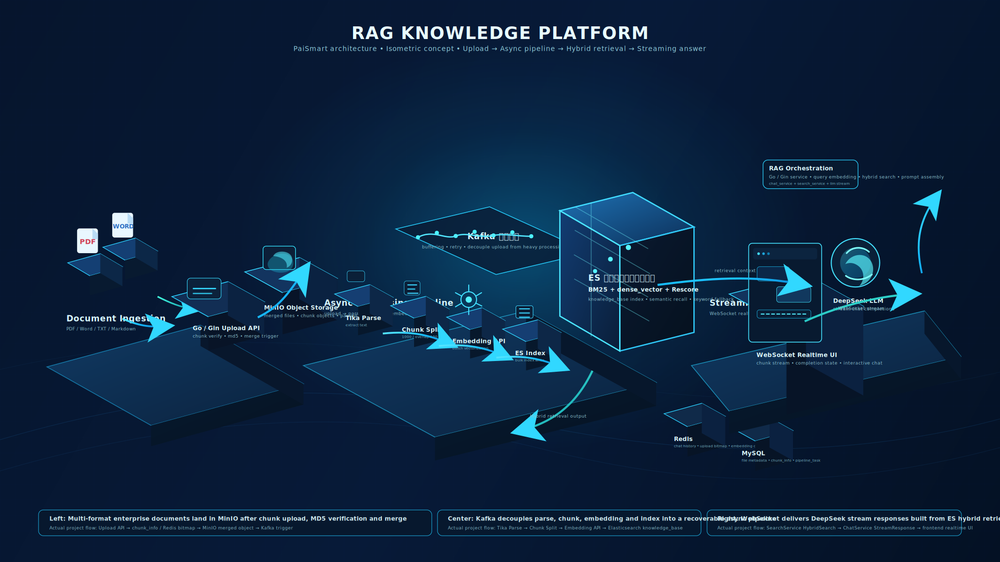

# PaiSmart RAG 智能知识引擎

PaiSmart 是一个面向企业知识场景的私有知识库与智能问答系统，提供从文档上传、异步解析、检索增强到多轮问答的完整链路。项目采用 Go + Vue 作为业务与交互层，结合 LangGraph / LangChain 构建 AI 编排与文档处理能力，适合用于企业知识库、内部问答助手、技术文档检索、流程与制度查询等场景。



## 项目特点

- 支持大文件分片上传、断点续传、秒传、失败重传与合并校验
- 支持 PDF、Word、Excel、PPT、TXT、Markdown 等多种文档格式入库
- 基于 Kafka 构建“解析 -> 切分 -> 向量化 -> 索引”异步流水线
- 支持 BM25、向量检索、短语兜底、RRF 融合与 Cross-Encoder 精排
- 支持基于 WebSocket 的流式回答输出与多轮追问
- 支持 LangGraph 状态编排、短期记忆 / 工作记忆 / 长期记忆协同
- 支持组织标签、公开文档、私有文档等多租户权限模型
- 提供用户管理、组织标签管理、文档管理、会话查看与任务重放能力

## 核心能力

### 1. 文档上传与入库

- 5MB 级分片上传
- Redis 记录上传状态与断点续传进度
- MD5 校验、秒传、失败重试
- MinIO 存储分片与合并文件
- Kafka 异步触发文档处理任务

### 2. 异步文档处理流水线

- `parse`：Tika 提取正文文本
- `chunk`：文本切分与块级结构化
- `embed`：Embedding 批量向量化
- `index`：写入 Elasticsearch 检索索引

当前项目同时支持两种执行方式：

- Go 本地处理链路
- Python ingestion worker 链路：基于 LangChain Text Splitter、Embeddings 与文档处理组件执行 stage 逻辑

### 3. 混合检索与召回优化

- BM25 关键词召回
- 向量检索
- query normalization
- 短语兜底
- RRF 融合
- 可选 Cross-Encoder 精排
- 权限过滤下沉到检索层，避免无权限内容进入上下文

### 4. 智能问答与多轮对话

- WebSocket 流式输出
- 意图识别、查询改写、追问判断
- 检索增强生成
- 感知记忆、工作记忆、长期记忆协同
- 聊天历史持久化

### 5. LangGraph / LangChain AI 编排

项目中的 Python `ai-orchestrator` 服务承担在线 AI 编排与文档处理能力：

- LangGraph 负责编排问答主链路
- LangChain 负责 Prompt、Retriever、Embeddings、Text Splitter 等组件抽象
- Go 服务继续负责上传、Kafka、Redis/MySQL/MinIO/ES 访问、WebSocket 转发与业务接口

在线问答图的大致流程如下：

```text
load_history
-> classify_intent
-> rewrite_query
-> prepare_prompt_context
-> retrieve_knowledge
-> retrieve_memory
-> fuse_context
-> rerank_context
-> build_messages
-> generate_answer
-> persist_memory
```

## 系统架构

### 业务服务

- `Go API Service`
  - 用户、权限、上传、文档管理、后台管理
  - Kafka producer / consumer
  - WebSocket 聊天入口
  - Elasticsearch / Redis / MySQL / MinIO 访问
  - LangGraph 在线问答入口代理与内部能力接口

- `Python AI Orchestrator`
  - LangGraph 在线问答编排
  - LangChain 检索器抽象与混合检索编排
  - 文档 ingestion worker
  - 内部 trace / health / smoke test 支持

### 基础设施

- MySQL 8
- Redis 7
- Kafka
- MinIO
- Elasticsearch 8
- Apache Tika
- LLM / Embedding / Reranker 服务

## 技术栈

- 后端：Go 1.23、Gin、GORM、Zap、JWT
- AI 编排：Python、FastAPI、LangGraph、LangChain、LangChain OpenAI
- 前端：Vue 3、TypeScript、Vite、Pinia、Vue Router、Naive UI、UnoCSS
- 中间件与存储：MySQL、Redis、Kafka、MinIO、Elasticsearch
- 模型服务：DeepSeek / Ollama、DashScope Embedding、Reranker、Apache Tika

## 项目结构

```text
cmd/
  server/                    Go 后端启动入口

internal/
  config/                    配置定义
  handler/                   HTTP / WebSocket 接口层
  middleware/                鉴权、日志、中间件
  model/                     领域模型与 DTO
  pipeline/                  文档异步处理逻辑
  repository/                数据访问层
  service/                   业务服务层

pkg/
  database/                  MySQL / Redis 初始化
  embedding/                 Embedding 客户端
  es/                        Elasticsearch 封装
  kafka/                     Kafka producer / consumer
  orchestrator/              Go <-> Python orchestrator / ingestion / memory client
  reranker/                  Reranker 客户端
  storage/                   MinIO 客户端
  tasks/                     Kafka stage 任务模型
  tika/                      Tika 客户端
  token/                     JWT 管理

ai-orchestrator/
  app/                       LangGraph / LangChain 服务
  requirements.txt           Python 依赖
  .env.example               Python 服务环境变量示例

frontend/
  src/                       Vue 前端项目

configs/
  config.yaml                本地开发配置
  config.docker-stack-run.yaml

docs/
  ddl.sql                    数据库初始化脚本
  rag-platform-isometric.svg 架构图

scripts/
  verify_langgraph_stack.py  双服务烟测脚本
```

## 主要页面

- 登录 / 注册
- 知识库管理
- 文档上传与文档检索
- 智能问答聊天页
- 聊天历史
- 用户管理
- 组织标签管理
- 个人中心

## 快速开始

### 1. 启动基础依赖

```bash
docker compose -f deployments/docker-compose.yaml up -d
```

默认包含：

- MySQL
- Redis
- MinIO
- Elasticsearch
- Kafka
- Zookeeper
- Apache Tika

### 2. 配置 Go 服务

编辑 [config.yaml](D:/vscode/paismart-go-main/configs/config.yaml)，填写以下配置：

- MySQL / Redis / MinIO
- Elasticsearch
- Kafka
- Tika
- Embedding 服务
- LLM 服务
- Agent 服务
- Reranker 服务

### 3. 启动 Go 服务

```bash
go mod download
go run cmd/server/main.go
```

默认地址：

```text
http://127.0.0.1:8081
```

健康检查：

```text
GET /healthz
```

### 4. 启动 Python AI Orchestrator

```powershell
python -m venv ai-orchestrator\.venv
ai-orchestrator\.venv\Scripts\python.exe -m pip install -r ai-orchestrator\requirements.txt
```

根据 [ai-orchestrator/.env.example](D:/vscode/paismart-go-main/ai-orchestrator/.env.example) 配置环境变量后启动：

```powershell
ai-orchestrator\.venv\Scripts\python.exe -m uvicorn app.main:app --app-dir ai-orchestrator --host 0.0.0.0 --port 8090
```

在线问答链路固定使用 LangGraph / LangChain，请在 [config.yaml](D:/vscode/paismart-go-main/configs/config.yaml) 中启用：

```yaml
ai:
  orchestrator:
    enabled: true
    ingestion_enabled: true
```

### 5. 启动前端

```bash
cd frontend
pnpm install
pnpm run dev
```

## 典型链路

### 文档入库链路

1. 用户上传文件
2. Go 服务完成分片校验与文件合并
3. 文件写入 MinIO
4. Kafka 投递异步任务
5. 解析、切分、向量化、索引分阶段执行
6. 文档进入 Elasticsearch 检索体系

### 智能问答链路

1. 用户通过 WebSocket 提问
2. Go 服务完成鉴权并转发给 AI Orchestrator
3. LangGraph 进行意图识别、查询改写、检索编排、上下文融合与生成
4. 回答按 token 流式返回给前端
5. 会话历史与记忆结果写回 Go 侧存储

## 权限模型

- 公共文档：所有用户可访问
- 私有文档：仅所属用户或同组织标签用户可访问
- 管理员：可管理用户、组织标签、文档，并查看全局会话数据

## 配置建议

- 生产环境建议将 API Key、数据库连接串、共享密钥改为环境变量注入
- `ai.orchestrator.enabled` 用于启用 LangGraph 在线问答编排
- `ai.orchestrator.ingestion_enabled` 用于启用 Python ingestion worker
- `shared_secret` 用于 Go 与 Python 内部接口鉴权

## 联调与诊断

项目内提供了一个双服务烟测脚本，可用于检查 Go 服务、Python orchestrator、内部检索接口与 ingestion route 是否连通：

```bash
python scripts/verify_langgraph_stack.py \
  --go-base-url http://127.0.0.1:8081 \
  --orchestrator-base-url http://127.0.0.1:8090 \
  --internal-token paismart-internal-dev \
  --user-id 1 \
  --username admin \
  --out benchmarks/results/langgraph-stack-smoke.json
```

Go 与 Python 内部调用会携带 `X-Trace-ID`，便于在日志中关联一次完整请求链路。

## 说明

- 本项目的在线问答链路固定走 LangGraph / LangChain orchestrator，Go 侧不再保留本地问答回退链路
- 发布前请替换示例配置中的敏感信息
