# PaiSmart RAG 智能知识引擎

PaiSmart 是一个面向企业知识场景的私有知识库与智能问答系统，覆盖文档上传、异步解析、混合检索、多轮问答、记忆管理与后台管理等完整能力。项目采用 Go 作为主要业务服务与基础设施接入层，结合 Python `ai-orchestrator` 提供基于 LangGraph / LangChain 的在线问答编排、记忆任务和文档处理能力，适合用于企业知识库、内部问答助手、技术文档检索、制度流程查询等场景。

## 系统架构图

完整双语版架构说明见 [docs/project-architecture.md](docs/project-architecture.md)。

```mermaid
flowchart TB
    subgraph Client["客户端与前端 / Client & Frontend"]
        U["用户与前端 / Users & Frontend<br/>登录 Login · 文档管理 Document Management · 智能问答 Chat"]
    end

    subgraph Gateway["Go 接入层 / Go Gateway Layer"]
        HTTP["HTTP API 接口 / HTTP API Endpoints<br/>REST 接口 · 文件上传 · 文档管理 · 管理后台"]
        WS["WebSocket 聊天网关 / WebSocket Chat Gateway<br/>鉴权 Auth · 会话接入 Session Access · 流式转发 Stream Relay · 停止控制 Stop Control"]
        AUTH["认证与鉴权 / Authentication & Authorization<br/>JWT 校验 · Token 黑名单 · 管理员权限"]
    end

    subgraph Biz["Go 业务服务层 / Go Business Services"]
        USER["用户服务 / User Service<br/>注册 Register · 登录 Login · 个人信息 Profile · 主组织 Primary Org"]
        ADMIN["管理后台服务 / Admin Service<br/>用户管理 User Admin · 标签管理 Tag Admin · 会话查看 Conversations · 任务重放 Replay"]
        DOC["文档服务 / Document Service<br/>可访问文档 Accessible Files · 下载 Download · 预览 Preview · 删除 Delete"]
        UP["上传服务 / Upload Service<br/>分片上传 Chunk Upload · 秒传 Fast Upload · 合并 Merge · 状态跟踪 Status"]
        CHAT["聊天服务 / Chat Service<br/>问答入口 Chat Entry · WebSocket Completion"]
        ORCHSUP["Orchestrator 支持服务 / Orchestrator Support Service<br/>会话加载 Session Load · Prompt Context · 检索 Search · 重排 Rerank · 持久化 Persist"]
    end

    subgraph Retrieval["检索与记忆治理 / Retrieval & Memory Governance"]
        SEARCH["检索服务 / Search Service<br/>BM25 · Vector · Phrase Fallback · RRF · Rerank"]
        PERM["权限过滤 / Permission Filter<br/>user_id · org_tag · is_public 前置过滤"]
        MEM["记忆服务 / Memory Service<br/>Sensory · Working · Profile · Long-term Memory"]
        SESSION["会话历史 / Session Memory<br/>当前会话 Current Conversation · Redis 历史窗口 Sliding Window"]
        WORKING["工作记忆 / Working Memory<br/>summary · facts · entities 快照 Snapshot"]
        PROFILE["用户画像 / Profile Memory<br/>primary_language · answer_style · current_project · role · deployment_env"]
        LTM["长期记忆 / Long-term Memory<br/>should_store · importance · 双存储 Dual Storage"]
        FUSE["上下文融合与统一重排 / Context Fusion & Unified Rerank<br/>知识 Knowledge + 记忆 Memory 跨源统一排序"]
    end

    subgraph Orchestrator["Python AI Orchestrator / Python AI Orchestrator"]
        APIORCH["FastAPI 编排服务 / FastAPI Orchestrator Service<br/>/v1/chat/stream · /v1/memory/* · /v1/ingestion/*"]
        LG["LangGraph 状态图 / LangGraph StateGraph<br/>在线问答主链路 Main QA Workflow"]
        PLAN["查询规划 / Query Planning<br/>意图识别 Intent · 查询改写 Rewrite · 检索模式 Retrieval Mode"]
        PROMPT["Prompt 组装 / Prompt Assembly<br/>规则 Rules · Memory Prelude · Context · History Window"]
        GEN["答案生成 / Answer Generation<br/>流式输出 Streaming Tokens · Done 事件"]
        RETK["知识检索器 / Knowledge Retriever<br/>GoKnowledgeRetriever · HybridKnowledgeRetriever"]
        RETM["记忆检索器 / Memory Retriever<br/>GoMemoryRetriever"]
        RERANK["上下文重排 / Context Rerank<br/>跨源片段 Mixed Context Rerank"]
        MTASK["记忆任务 / Memory Tasks<br/>工作记忆摘要 Working Summary · 长期记忆抽取 Long-term Extraction"]
        ING["文档处理 Worker / Ingestion Worker<br/>Parse · Chunk · Embed · Index"]
    end

    subgraph Pipeline["异步文档流水线 / Async Document Pipeline"]
        KAFKA["Kafka 任务总线 / Kafka Task Bus<br/>parse · chunk · embed · index · dlq"]
        PROC["Go Pipeline Processor / Go Pipeline Processor<br/>Stage 调度 Scheduling · 重试 Retry · 回放 Replay"]
        PARSE["解析阶段 / Parse Stage<br/>正文抽取 Text Extraction"]
        CHUNK["切分阶段 / Chunk Stage<br/>块切分 Chunking · 结构化片段 Structured Chunks"]
        EMBED["向量化阶段 / Embed Stage<br/>批量向量生成 Batch Embeddings"]
        INDEX["索引阶段 / Index Stage<br/>ES Bulk 写入 Bulk Indexing"]
    end

    subgraph Data["数据与基础设施 / Data & Infrastructure"]
        MYSQL["MySQL / MySQL<br/>用户 Users · 文档元数据 File Metadata · Long-term Memory · Pipeline Task"]
        REDIS["Redis / Redis<br/>上传进度 Upload Status · 当前会话 Current Conversation · 会话历史 Conversation History"]
        MINIO["MinIO / MinIO<br/>分片对象 Chunks · 合并文件 Merged Files · 中间产物 Artifacts"]
        ES["Elasticsearch / Elasticsearch<br/>知识索引 Knowledge Index · 记忆索引 Memory Index"]
        TIKA["Tika / Tika<br/>多格式文档正文抽取 Multi-format Text Extraction"]
        EMBSVC["Embedding 服务 / Embedding Service<br/>查询向量 Query Embeddings · 文档向量 Document Embeddings"]
        RR["Reranker 服务 / Reranker Service<br/>Cross-Encoder 精排 Cross-Encoder Rerank"]
        LLM["LLM 服务 / LLM Service<br/>Planner 模型 Planner Model · Answer 模型 Answer Model"]
    end

    U --> HTTP
    U --> WS

    HTTP --> AUTH
    WS --> AUTH

    AUTH --> USER
    AUTH --> CHAT
    HTTP --> UP
    HTTP --> DOC
    HTTP --> ADMIN

    USER --> MYSQL
    USER --> REDIS
    ADMIN --> MYSQL
    ADMIN --> REDIS
    ADMIN --> KAFKA
    DOC --> MYSQL
    DOC --> MINIO
    UP --> REDIS
    UP --> MINIO
    UP --> MYSQL
    UP --> KAFKA

    CHAT --> APIORCH
    APIORCH --> LG
    LG --> PLAN
    LG --> PROMPT
    LG --> GEN
    LG --> RETK
    LG --> RETM
    LG --> RERANK
    LG --> MTASK

    PLAN --> LLM
    PROMPT --> ORCHSUP
    GEN --> LLM
    GEN --> WS

    RETK --> ORCHSUP
    RETM --> ORCHSUP
    RERANK --> ORCHSUP
    MTASK --> LLM

    ORCHSUP --> SESSION
    ORCHSUP --> SEARCH
    ORCHSUP --> MEM
    ORCHSUP --> FUSE

    SEARCH --> PERM
    SEARCH --> ES
    SEARCH --> EMBSVC
    SEARCH --> RR

    MEM --> SESSION
    MEM --> WORKING
    MEM --> PROFILE
    MEM --> LTM
    MEM --> ES
    MEM --> MYSQL
    MEM --> EMBSVC
    MEM --> APIORCH

    FUSE --> RR
    FUSE --> ES

    KAFKA --> PROC
    PROC --> PARSE
    PROC --> CHUNK
    PROC --> EMBED
    PROC --> INDEX
    PROC --> ING

    PARSE --> TIKA
    PARSE --> MINIO
    CHUNK --> ING
    EMBED --> ING
    EMBED --> EMBSVC
    INDEX --> ING
    INDEX --> ES

    ING --> TIKA
    ING --> EMBSVC
    ING --> ES

    SESSION --> REDIS
    WORKING --> MYSQL
    PROFILE --> MYSQL
    LTM --> MYSQL
    LTM --> ES
```



## 功能概览

- 大文件分片上传、断点续传、秒传、失败重试与合并校验
- PDF、Word、Excel、PPT、TXT、Markdown 等多种文档格式入库
- 基于 Kafka 的 `parse -> chunk -> embed -> index` 异步处理流水线
- BM25、向量检索、短语兜底、RRF 融合与 Cross-Encoder 精排
- 基于 WebSocket 的流式回答输出与多轮追问
- Session Memory、Sensory Memory、Working Memory、Profile Memory、Long-term Memory 五层记忆体系
- 公开文档、私有文档、组织标签文档等多租户权限模型
- 用户管理、组织标签管理、文档管理、会话查看与任务重放

## 系统组成

### Go API Service

Go 服务负责业务接入和基础设施访问，是系统的主入口：

- HTTP / WebSocket 接口
- 用户、权限、文档、后台管理
- MySQL / Redis / MinIO / Elasticsearch / Kafka 访问
- 检索实现、权限过滤、记忆存储与会话管理
- 对 Python orchestrator 暴露内部支持接口

### Python AI Orchestrator

`ai-orchestrator` 服务负责 AI 编排与部分智能任务：

- LangGraph 在线问答主链路
- LangChain Prompt、Retriever、Embeddings、Text Splitter 等组件抽象
- 工作记忆摘要与长期记忆抽取
- 文档 ingestion worker
- 流式响应、trace、健康检查与烟测支持

### 基础设施

- MySQL 8
- Redis 7
- Kafka
- MinIO
- Elasticsearch 8
- Apache Tika
- LLM / Embedding / Reranker 服务

## 核心能力

### 1. 文档上传与入库

- 5MB 级分片上传
- Redis 记录上传状态与续传进度
- MD5 校验、秒传、失败重试
- MinIO 存储分片和合并文件
- Kafka 异步触发文档处理任务

### 2. 异步文档处理流水线

文档入库采用四段式异步流水线：

- `parse`：通过 Tika 提取正文文本
- `chunk`：切分文本块并保留块级结构
- `embed`：批量生成向量
- `index`：写入 Elasticsearch 检索索引

当前支持两种执行方式：

- Go 本地处理链路
- Python ingestion worker 链路：基于 LangChain Text Splitter 与 Embeddings 执行处理逻辑

### 3. 混合检索与召回优化

- BM25 关键词召回
- 向量检索
- Query Normalization
- 短语兜底
- RRF 融合
- 可选 Cross-Encoder 精排
- 权限过滤前置到检索层，避免无权限内容进入上下文

### 4. 智能问答与多轮对话

- WebSocket 流式输出
- 意图识别、查询改写、追问判断
- 检索增强生成
- 感知记忆、工作记忆、长期记忆协同
- 聊天历史与记忆结果持久化

### 5. LangGraph / LangChain AI 编排

在线问答主链路固定由 `ai-orchestrator` 承担，流程如下：

```text
load_history
-> classify_intent
-> rewrite_query
-> prepare_prompt_context
-> retrieve_knowledge
-> retrieve_memory
-> fuse_context
-> rerank_context
-> build_messages
-> generate_answer
-> persist_memory
```

其中：

- LangGraph 负责状态流转与节点编排
- LangChain 负责 Prompt、Retriever、Embeddings、Text Splitter 等能力抽象
- Go 服务负责内部会话、检索、重排、记忆存储和业务接口

## 项目结构

```text
cmd/
  server/                    Go 后端启动入口

internal/
  config/                    配置定义
  handler/                   HTTP / WebSocket 接口层
  middleware/                鉴权、日志与中间件
  model/                     领域模型与 DTO
  pipeline/                  文档异步处理逻辑
  repository/                数据访问层
  service/                   业务服务层

pkg/
  database/                  MySQL / Redis 初始化
  embedding/                 Embedding 客户端
  es/                        Elasticsearch 封装
  kafka/                     Kafka producer / consumer
  orchestrator/              Go <-> Python orchestrator / ingestion / memory client
  reranker/                  Reranker 客户端
  storage/                   MinIO 客户端
  tasks/                     Kafka stage 任务模型
  tika/                      Tika 客户端
  token/                     JWT 管理

ai-orchestrator/
  app/                       LangGraph / LangChain 服务
  requirements.txt           Python 依赖
  .env.example               Python 服务环境变量示例

frontend/
  src/                       Vue 前端项目

configs/
  config.yaml                本地开发配置
  config.docker-stack-run.yaml

docs/
  ddl.sql                    数据库初始化脚本
  local-dev-runbook.md       本地开发说明

scripts/
  verify_langgraph_stack.py  双服务烟测脚本
```

## 技术栈

- 后端：Go 1.23、Gin、GORM、Zap、JWT
- AI 编排：Python、FastAPI、LangGraph、LangChain、LangChain OpenAI
- 前端：Vue 3、TypeScript、Vite、Pinia、Vue Router、Naive UI、UnoCSS
- 中间件与存储：MySQL、Redis、Kafka、MinIO、Elasticsearch
- 模型服务：DeepSeek / Ollama、Embedding、Reranker、Apache Tika

## 主要页面

- 登录 / 注册
- 知识库管理
- 文档上传与文档检索
- 智能问答聊天页
- 聊天历史
- 用户管理
- 组织标签管理
- 个人中心

## 快速开始

### 1. 启动基础依赖

```bash
docker compose -f deployments/docker-compose.yaml up -d
```

默认包含：

- MySQL
- Redis
- MinIO
- Elasticsearch
- Kafka
- Zookeeper
- Apache Tika

### 2. 配置 Go 服务

编辑 [configs/config.yaml](configs/config.yaml)，填写或调整以下配置：

- MySQL / Redis / MinIO
- Elasticsearch
- Kafka
- Tika
- Embedding 服务
- LLM 服务
- Reranker 服务
- `ai.orchestrator` 相关配置

### 3. 启动 Go 服务

```bash
go mod download
go run cmd/server/main.go
```

默认地址：

```text
http://127.0.0.1:8081
```

健康检查：

```text
GET /healthz
```

### 4. 启动 Python AI Orchestrator

```powershell
python -m venv ai-orchestrator\.venv
ai-orchestrator\.venv\Scripts\python.exe -m pip install -r ai-orchestrator\requirements.txt
```

根据 [ai-orchestrator/.env.example](ai-orchestrator/.env.example) 配置环境变量后启动：

```powershell
ai-orchestrator\.venv\Scripts\python.exe -m uvicorn app.main:app --app-dir ai-orchestrator --host 0.0.0.0 --port 8090
```

在线问答链路固定依赖 orchestrator，请在 [configs/config.yaml](configs/config.yaml) 中启用：

```yaml
ai:
  orchestrator:
    enabled: true
    ingestion_enabled: true
```

### 5. 启动前端

```bash
cd frontend
pnpm install
pnpm run dev
```

## 典型链路

### 文档入库链路

1. 用户上传文件
2. Go 服务完成分片校验与文件合并
3. 文件写入 MinIO
4. Kafka 投递异步任务
5. 解析、切分、向量化、索引分阶段执行
6. 文档进入 Elasticsearch 检索体系

### 智能问答链路

1. 用户通过 WebSocket 提问
2. Go 服务完成鉴权并转发给 AI Orchestrator
3. LangGraph 执行查询规划、检索编排、上下文融合与答案生成
4. 回答按 token 流式返回给前端
5. 会话历史与记忆结果写回 Go 侧存储

## 权限模型

- 公共文档：所有用户可访问
- 私有文档：仅所属用户或同组织标签用户可访问
- 管理员：可管理用户、组织标签、文档，并查看全局会话数据

## 配置建议

- 生产环境建议将数据库连接串、API Key、共享密钥改为环境变量或密钥管理服务注入
- `ai.orchestrator.enabled` 用于启用 LangGraph 在线问答编排
- `ai.orchestrator.ingestion_enabled` 用于启用 Python ingestion worker
- `shared_secret` 用于 Go 与 Python 内部接口鉴权

## 联调与诊断

项目内提供了一个双服务烟测脚本，用于检查 Go 服务、Python orchestrator、内部检索接口与 ingestion route 是否连通：

```bash
python scripts/verify_langgraph_stack.py \
  --go-base-url http://127.0.0.1:8081 \
  --orchestrator-base-url http://127.0.0.1:8090 \
  --internal-token paismart-internal-dev \
  --user-id 1 \
  --username admin \
  --out benchmarks/results/langgraph-stack-smoke.json
```

Go 与 Python 内部调用会携带 `X-Trace-ID`，便于在日志中关联一次完整请求链路。

## 说明

- 在线问答链路固定走 LangGraph / LangChain orchestrator
- Go 侧不再保留本地问答回退链路
- 发布前请替换示例配置中的敏感信息
