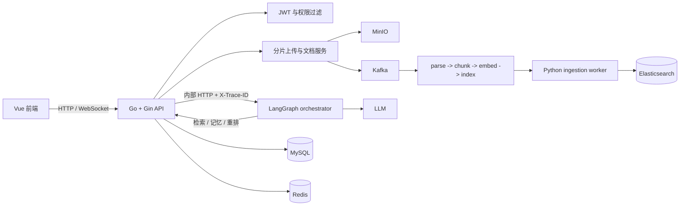

# RHA

RHA 是面向企业私有知识场景的高可用多模态 RAG 平台。它将文档接入、结构化解析、异步入库、混合检索和 LangGraph 多轮问答组合成一条可观测的私有化链路，并通过权限过滤、可恢复任务和页面级证据引用，让回答更容易追溯和运营。

适用场景包括企业制度与流程问答、技术文档助手、内部知识库检索，以及需要保留文档版本和访问边界的私有部署场景。

## 核心能力

### 多模态文档解析

RHA 为不同文档结构使用不同的切分和证据模型，解析结果携带 `documentVersion`、解析器版本、来源路径和可选位置字段：

| 模态 | 结构化策略 | 引用定位 |
| --- | --- | --- |
| PDF | MinerU + OCR，按页和页面元素生成证据 | 页码、`bbox` |
| Word | 按标题层级维护 `headingPath`，按段落生成证据 | 标题路径 |
| PowerPoint | 按 Slide 提取文本 | Slide 编号 |
| Excel | 按 Sheet 和表头读取，按行窗口切分 | Sheet、表头、行范围 |
| TXT / Markdown | 按文本块切分 | 来源文件 |

生产 PDF 路由要求 MinerU 输出包含 OCR 确认和页面 `bbox` 的 JSON 回执；MinerU 不可用时会明确失败，不回退到 Tika。Word、PPT 和 Excel 使用 Python 结构化解析器，结构化片段和证据 ID 会一路传递到索引和问答引用。

### 可恢复的文档入库

- 分片上传、断点续传、秒传、分片 MD5 校验和合并完整性校验
- Redis 保存上传进度，MinIO 保存分片与合并对象
- Kafka 四阶段流水线：`parse -> chunk -> embed -> index`
- 每个阶段按文档版本和窗口建立可恢复任务，支持幂等处理、指数退避重试和 `file-dlq` 死信队列
- 管理端可以按失败阶段回放任务；Elasticsearch 使用物理索引 + read alias 进行原子切换

### 混合检索与降级

- BM25、向量 KNN 和短语召回并行执行
- 使用 RRF 融合候选，按需调用 Cross-Encoder 重排
- `user_id`、组织标签和 `is_public` 在 Elasticsearch 查询中过滤，避免无权限内容进入上下文
- Embedding 或向量召回失败时继续使用 BM25；Reranker 超时或失败时返回融合结果并记录 `rerank_skipped`
- 检索日志记录召回候选、重排状态、延迟和可选离线评测指标

### LangGraph 多轮问答与长期记忆

Python `ai-orchestrator` 通过 11 个 LangGraph 节点编排在线问答：

```text
load_history
-> classify_intent
-> rewrite_query
-> prepare_prompt_context
-> retrieve_knowledge
-> retrieve_memory
-> fuse_context
-> rerank_context
-> build_messages
-> generate_answer
-> persist_memory
```

Go 负责鉴权、会话、检索、重排和持久化，Python 负责图编排、Prompt 组装、模型调用和记忆任务。问答通过 WebSocket 流式返回 token、trace 和完成事件，并支持会话历史、工作记忆、用户画像和长期记忆。

### 可追溯与可观测

- Go 与 Python 的内部 HTTP 调用、聊天流和 Kafka 任务模型支持传播 `X-Trace-ID`
- 文档流水线、检索、重排和生成等核心阶段保留 trace/span 边界
- Go 和 Python 提供 OpenTelemetry span 边界与接入点，同时保留带 trace ID 的结构化日志；生产环境可按所用 collector 补充 SDK/exporter 配置
- 完成事件中的引用包含 `evidenceId`、文档版本、来源路径以及页码、Slide、Sheet 或 `bbox` 等定位信息

## 架构


```mermaid
flowchart LR
    UI[Vue 前端] -->|HTTP / WebSocket| GO[Go + Gin API]
    GO --> AUTH[JWT 与权限过滤]
    GO --> UP[分片上传与文档服务]
    UP --> OBJ[MinIO]
    UP --> MQ[Kafka]
    MQ --> PIPE[parse -> chunk -> embed -> index]
    PIPE --> PY[Python ingestion worker]
    PY --> ES[(Elasticsearch)]
    GO -->|内部 HTTP + X-Trace-ID| ORCH[LangGraph orchestrator]
    ORCH -->|检索 / 记忆 / 重排| GO
    ORCH --> LLM[LLM]
    GO --> MYSQL[(MySQL)]
    GO --> REDIS[(Redis)]
```

## 技术栈

| 层次 | 组件 |
| --- | --- |
| API 与业务 | Go 1.23、Gin、GORM、JWT、WebSocket |
| AI 编排 | Python、FastAPI、LangGraph、LangChain |
| 数据与消息 | MySQL 8、Redis 7、Kafka、Elasticsearch 8、MinIO |
| 模型服务 | OpenAI 兼容的 LLM / Embedding、Cross-Encoder Reranker |
| 文档处理 | MinerU + OCR、Office Open XML 结构化解析 |
| 前端 | Vue 3、TypeScript、Vite、Naive UI、Pinia |
| 可观测性 | OpenTelemetry API 接入点、结构化日志、Trace ID 传播 |

## 项目结构

```text
cmd/server/                 Go 服务入口
internal/handler/           HTTP、WebSocket 和管理接口
internal/service/           用户、文档、上传、检索、聊天和记忆服务
internal/pipeline/          Kafka 文档流水线处理器
internal/repository/        MySQL / Redis 数据访问
pkg/kafka/                  Kafka producer、consumer、重试和 DLQ
pkg/es/                     Elasticsearch 索引、检索和 alias
pkg/orchestrator/           Go 与 Python 服务通信客户端
pkg/observability/          Trace ID 和 span 边界
ai-orchestrator/app/        LangGraph、检索器、记忆和结构化 ingestion
frontend/                   Vue 管理端与聊天界面
deployments/                Docker Compose、Embedding 和 Reranker 服务
configs/                    Go 服务配置模板
docs/                       DDL、架构说明和本地运行手册
scripts/                    烟测、fixture 校验和基准脚本
benchmarks/                 离线评测集与结果样例
```

## 快速开始

### 1. 启动基础设施

需要 Docker Desktop、Go 1.23+、Python 3.11+、Node 18+ 和 pnpm 8+。

```bash
docker compose -f deployments/docker-compose.yaml up -d
```

该 Compose 文件会启动 MySQL、Redis、MinIO、Kafka、Zookeeper、Elasticsearch、Tika、Embedding 和 Reranker。默认端口见 [docs/local-dev-runbook.md](docs/local-dev-runbook.md)。本地默认账号和密钥只用于开发，部署前请替换。

### 2. 初始化并启动 Go API

```bash
go mod download
go run ./cmd/server
```

服务默认监听 `http://127.0.0.1:8081`，健康检查：

```text
GET /healthz
```

根据环境修改 [configs/config.yaml](configs/config.yaml)，特别是 MySQL、Redis、MinIO、Kafka、Elasticsearch、Embedding、Reranker 和 `ai.orchestrator` 配置。

### 3. 启动 Python orchestrator

```powershell
python -m venv ai-orchestrator\.venv
ai-orchestrator\.venv\Scripts\python.exe -m pip install -r ai-orchestrator\requirements.txt
$env:RHA_INTERNAL_TOKEN="replace-with-a-private-token"
$env:RHA_GO_BASE_URL="http://127.0.0.1:8081"
$env:RHA_LLM_API_KEY="replace-with-your-llm-key"
ai-orchestrator\.venv\Scripts\python.exe -m uvicorn app.main:app --app-dir ai-orchestrator --host 0.0.0.0 --port 8090
```

在 Go 配置中启用：

```yaml
ai:
  orchestrator:
    enabled: true
    ingestion_enabled: true
    base_url: "http://127.0.0.1:8090"
```

完整变量说明见 [ai-orchestrator/.env.example](ai-orchestrator/.env.example) 和 [docs/local-dev-runbook.md](docs/local-dev-runbook.md)。

### 4. 启动前端

```bash
cd frontend
pnpm install
pnpm dev
```

开发地址通常为 `http://127.0.0.1:5173`。

## 主要接口

登录后，业务 API 位于 `/api/v1`：

| 领域 | 接口 |
| --- | --- |
| 认证 | `POST /users/login`、`POST /users/register` |
| 上传 | `POST /upload/check`、`POST /upload/chunk`、`POST /upload/merge`、`GET /upload/status` |
| 文档 | `GET /documents/accessible`、`GET /documents/preview`、`GET /documents/download` |
| 检索 | `GET /search/hybrid` |
| 对话 | `GET /chat/websocket-token`，再连接根路径 `GET /chat/:token` |
| 管理 | `POST /admin/pipeline/replay`、用户/组织标签/会话管理接口 |

Go 与 Python 的内部接口使用 `X-Internal-Token`，不应直接暴露到公网。内部接口和 ingestion contract 见 [ai-orchestrator/README.md](ai-orchestrator/README.md)。

## 验证与离线评测

运行 Go 与 Python 单元测试：

```bash
go test ./...
PYTHONPATH=ai-orchestrator python -m unittest discover -s ai-orchestrator/tests -v
```

验证多模态结构化契约：

```bash
python scripts/verify_rha_fixture.py
```

验证 Go 网关、Python orchestrator、内部检索和 ingestion route 的联通性：

```bash
python scripts/verify_langgraph_stack.py \
  --go-base-url http://127.0.0.1:8081 \
  --orchestrator-base-url http://127.0.0.1:8090 \
  --internal-token "$RHA_INTERNAL_TOKEN" \
  --user-id 1 \
  --username admin \
  --out benchmarks/results/langgraph-stack-smoke.json
```

离线检索、RAG 流式和上传基准的命令与指标定义见 [docs/benchmark-guide.md](docs/benchmark-guide.md)。仓库中的历史上传样本 `benchmarks/results/upload-baguwen-benchmark.json` 记录了 120 份文档的上传成功率 100%，合并 P95 约 2.445 秒；这是上传/合并阶段数据，不代表后续解析、Embedding 和 Elasticsearch 可检索率。

当前多模态契约 fixture 覆盖 PDF、Word、PPT、Excel 四种模态，共 8 个示例证据单元，用于验证字段和引用链路，不应解读为生产数据规模。

## 设计文档

- [项目架构](docs/project-architecture.md)
- [本地运行手册](docs/local-dev-runbook.md)
- [Kafka 流水线](docs/kafka.md)
- [RHA E2E 运行手册](docs/rha-e2e-runbook.md)
- [数据库 DDL](docs/ddl.sql)
