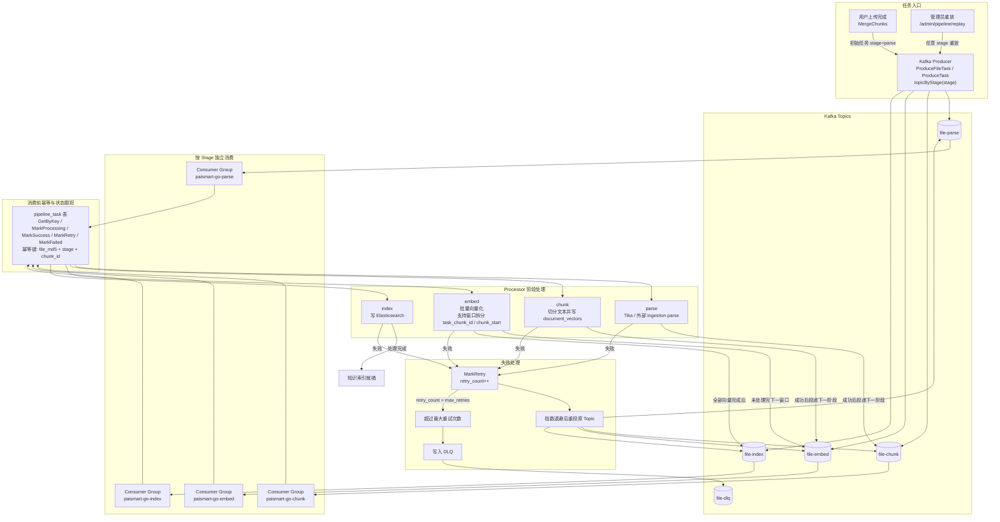

# Kafka Pipeline Overview

下面这张图对应本项目文档处理链路里 Kafka 的真实用法，包含：

- 上传完成后的初始投递
- 管理员按 stage 重放
- `parse -> chunk -> embed -> index` 四阶段 topic
- 独立 consumer group
- `pipeline_task` 幂等与状态跟踪
- 失败重试与 DLQ

```mermaid
flowchart TB
    subgraph Entry["任务入口"]
        U["用户上传完成<br/>MergeChunks"]
        A["管理员重放<br/>/admin/pipeline/replay"]
        R["Kafka Producer<br/>ProduceFileTask / ProduceTask<br/>topicByStage(stage)"]
    end

    U -->|初始任务 stage=parse| R
    A -->|任意 stage 重放| R

    subgraph Topics["Kafka Topics"]
        T1[("file-parse")]
        T2[("file-chunk")]
        T3[("file-embed")]
        T4[("file-index")]
        T5[("file-dlq")]
    end

    R --> T1
    R --> T2
    R --> T3
    R --> T4

    subgraph Consumers["按 Stage 独立消费"]
        C1["Consumer Group<br/>paismart-go-parse"]
        C2["Consumer Group<br/>paismart-go-chunk"]
        C3["Consumer Group<br/>paismart-go-embed"]
        C4["Consumer Group<br/>paismart-go-index"]
    end

    T1 --> C1
    T2 --> C2
    T3 --> C3
    T4 --> C4

    subgraph Guard["消费前幂等与状态跟踪"]
        G["pipeline_task 表<br/>GetByKey / MarkProcessing / MarkSuccess / MarkRetry / MarkFailed<br/>幂等键: file_md5 + stage + chunk_id"]
    end

    C1 --> G
    C2 --> G
    C3 --> G
    C4 --> G

    subgraph Processor["Processor 阶段处理"]
        P1["parse<br/>Tika / 外部 ingestion parse"]
        P2["chunk<br/>切分文本并写 document_vectors"]
        P3["embed<br/>批量向量化<br/>支持窗口拆分 task_chunk_id / chunk_start"]
        P4["index<br/>写 Elasticsearch"]
    end

    G --> P1
    G --> P2
    G --> P3
    G --> P4

    P1 -->|成功后投递下一阶段| T2
    P2 -->|成功后投递下一阶段| T3
    P3 -->|未处理完下一窗口| T3
    P3 -->|全部向量完成后| T4
    P4 -->|处理完成| D["知识索引就绪"]

    subgraph Failure["失败处理"]
        F1["MarkRetry<br/>retry_count++"]
        F2["指数退避后重投原 Topic"]
        F3["超过最大重试次数"]
        F4["写入 DLQ"]
    end

    P1 -->|失败| F1
    P2 -->|失败| F1
    P3 -->|失败| F1
    P4 -->|失败| F1

    F1 --> F2
    F2 --> T1
    F2 --> T2
    F2 --> T3
    F2 --> T4
    F1 -->|retry_count > max_retries| F3 --> F4 --> T5
```
