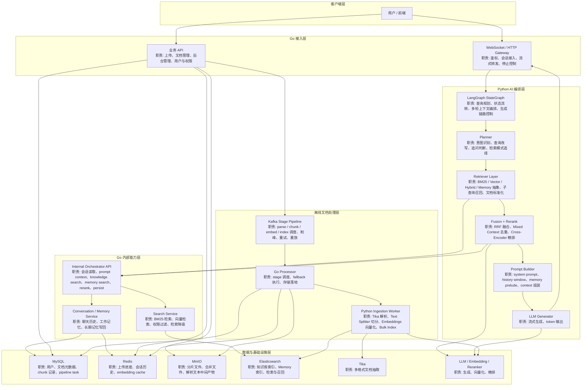

# LangGraph / LangChain 架构图

下面这张图适合用于面试讲解当前项目的职责分层与调用关系。

```mermaid
flowchart TB
    subgraph Client["客户端层"]
        U["用户 / 前端"]
    end

    subgraph Gateway["Go 接入层"]
        WS["WebSocket / HTTP Gateway<br/>职责: 鉴权、会话接入、流式转发、停止控制"]
        API["业务 API<br/>职责: 上传、文档管理、后台管理、用户与权限"]
    end

    subgraph Orchestrator["Python AI 编排层"]
        LG["LangGraph StateGraph<br/>职责: 查询规划、状态流转、多轮上下文编排、生成链路控制"]
        PLAN["Planner<br/>职责: 意图识别、查询改写、追问判断、检索模式选择"]
        RET["Retriever Layer<br/>职责: BM25 / Vector / Hybrid / Memory 抽象、子查询召回、文档标准化"]
        FUSE["Fusion + Rerank<br/>职责: RRF 融合、Mixed Context 去重、Cross-Encoder 精排"]
        PROMPT["Prompt Builder<br/>职责: system prompt、history window、memory prelude、context 组装"]
        GEN["LLM Generator<br/>职责: 流式生成、token 输出"]
    end

    subgraph GoSupport["Go 内部能力层"]
        ORCHAPI["Internal Orchestrator API<br/>职责: 会话读取、prompt context、knowledge search、memory search、rerank、persist"]
        CHATSTORE["Conversation / Memory Service<br/>职责: 聊天历史、工作记忆、长期记忆写回"]
        SEARCH["Search Service<br/>职责: BM25 检索、向量检索、权限过滤、检索降级"]
    end

    subgraph Ingestion["离线文档处理层"]
        KAFKA["Kafka Stage Pipeline<br/>职责: parse / chunk / embed / index 调度、削峰、重试、重放"]
        PROC["Go Processor<br/>职责: stage 调度、fallback 执行、存储落地"]
        ING["Python Ingestion Worker<br/>职责: Tika 解析、Text Splitter 切分、Embeddings 向量化、Bulk Index"]
    end

    subgraph Storage["数据与基础设施层"]
        MYSQL["MySQL<br/>职责: 用户、文档元数据、chunk 记录、pipeline task"]
        REDIS["Redis<br/>职责: 上传进度、会话历史、embedding cache"]
        MINIO["MinIO<br/>职责: 分片文件、合并文件、解析文本中间产物"]
        ES["Elasticsearch<br/>职责: 知识库索引、Memory 索引、检索与召回"]
        TIKA["Tika<br/>职责: 多格式文档抽取"]
        MODEL["LLM / Embedding / Reranker<br/>职责: 生成、向量化、精排"]
    end

    U --> WS
    U --> API

    WS --> LG
    LG --> PLAN
    PLAN --> RET
    RET --> ORCHAPI
    ORCHAPI --> SEARCH
    ORCHAPI --> CHATSTORE
    SEARCH --> ES
    CHATSTORE --> REDIS
    CHATSTORE --> MYSQL

    RET --> FUSE
    FUSE --> ORCHAPI
    FUSE --> MODEL
    FUSE --> PROMPT
    PROMPT --> GEN
    GEN --> MODEL
    GEN --> WS

    API --> MINIO
    API --> MYSQL
    API --> REDIS
    API --> KAFKA

    KAFKA --> PROC
    PROC --> ING
    PROC --> MINIO
    PROC --> MYSQL
    PROC --> REDIS
    ING --> TIKA
    ING --> MODEL
    ING --> ES
```
