# PaiSmart 项目全景架构图 / Project Architecture

下面这张图展示了 PaiSmart 的主要功能模块、调用关系和基础设施依赖。节点统一采用中英文双语标注，便于作为项目说明、团队协作和架构沟通的参考。

```mermaid
flowchart TB
    subgraph Client["客户端与前端 / Client & Frontend"]
        U["用户与前端 / Users & Frontend<br/>登录 Login · 文档管理 Document Management · 智能问答 Chat"]
    end

    subgraph Gateway["Go 接入层 / Go Gateway Layer"]
        HTTP["HTTP API 接口 / HTTP API Endpoints<br/>REST 接口 · 文件上传 · 文档管理 · 管理后台"]
        WS["WebSocket 聊天网关 / WebSocket Chat Gateway<br/>鉴权 Auth · 会话接入 Session Access · 流式转发 Stream Relay · 停止控制 Stop Control"]
        AUTH["认证与鉴权 / Authentication & Authorization<br/>JWT 校验 · Token 黑名单 · 管理员权限"]
    end

    subgraph Biz["Go 业务服务层 / Go Business Services"]
        USER["用户服务 / User Service<br/>注册 Register · 登录 Login · 个人信息 Profile · 主组织 Primary Org"]
        ADMIN["管理后台服务 / Admin Service<br/>用户管理 User Admin · 标签管理 Tag Admin · 会话查看 Conversations · 任务重放 Replay"]
        DOC["文档服务 / Document Service<br/>可访问文档 Accessible Files · 下载 Download · 预览 Preview · 删除 Delete"]
        UP["上传服务 / Upload Service<br/>分片上传 Chunk Upload · 秒传 Fast Upload · 合并 Merge · 状态跟踪 Status"]
        CHAT["聊天服务 / Chat Service<br/>问答入口 Chat Entry · WebSocket Completion"]
        ORCHSUP["Orchestrator 支持服务 / Orchestrator Support Service<br/>会话加载 Session Load · Prompt Context · 检索 Search · 重排 Rerank · 持久化 Persist"]
    end

    subgraph Retrieval["检索与记忆治理 / Retrieval & Memory Governance"]
        SEARCH["检索服务 / Search Service<br/>BM25 · Vector · Phrase Fallback · RRF · Rerank"]
        PERM["权限过滤 / Permission Filter<br/>user_id · org_tag · is_public 前置过滤"]
        MEM["记忆服务 / Memory Service<br/>Sensory · Working · Profile · Long-term Memory"]
        SESSION["会话历史 / Session Memory<br/>当前会话 Current Conversation · Redis 历史窗口 Sliding Window"]
        WORKING["工作记忆 / Working Memory<br/>summary · facts · entities 快照 Snapshot"]
        PROFILE["用户画像 / Profile Memory<br/>primary_language · answer_style · current_project · role · deployment_env"]
        LTM["长期记忆 / Long-term Memory<br/>should_store · importance · 双存储 Dual Storage"]
        FUSE["上下文融合与统一重排 / Context Fusion & Unified Rerank<br/>知识 Knowledge + 记忆 Memory 跨源统一排序"]
    end

    subgraph Orchestrator["Python AI Orchestrator / Python AI Orchestrator"]
        APIORCH["FastAPI 编排服务 / FastAPI Orchestrator Service<br/>/v1/chat/stream · /v1/memory/* · /v1/ingestion/*"]
        LG["LangGraph 状态图 / LangGraph StateGraph<br/>在线问答主链路 Main QA Workflow"]
        PLAN["查询规划 / Query Planning<br/>意图识别 Intent · 查询改写 Rewrite · 检索模式 Retrieval Mode"]
        PROMPT["Prompt 组装 / Prompt Assembly<br/>规则 Rules · Memory Prelude · Context · History Window"]
        GEN["答案生成 / Answer Generation<br/>流式输出 Streaming Tokens · Done 事件"]
        RETK["知识检索器 / Knowledge Retriever<br/>GoKnowledgeRetriever · HybridKnowledgeRetriever"]
        RETM["记忆检索器 / Memory Retriever<br/>GoMemoryRetriever"]
        RERANK["上下文重排 / Context Rerank<br/>跨源片段 Mixed Context Rerank"]
        MTASK["记忆任务 / Memory Tasks<br/>工作记忆摘要 Working Summary · 长期记忆抽取 Long-term Extraction"]
        ING["文档处理 Worker / Ingestion Worker<br/>Parse · Chunk · Embed · Index"]
    end

    subgraph Pipeline["异步文档流水线 / Async Document Pipeline"]
        KAFKA["Kafka 任务总线 / Kafka Task Bus<br/>parse · chunk · embed · index · dlq"]
        PROC["Go Pipeline Processor / Go Pipeline Processor<br/>Stage 调度 Scheduling · 重试 Retry · 回放 Replay"]
        PARSE["解析阶段 / Parse Stage<br/>正文抽取 Text Extraction"]
        CHUNK["切分阶段 / Chunk Stage<br/>块切分 Chunking · 结构化片段 Structured Chunks"]
        EMBED["向量化阶段 / Embed Stage<br/>批量向量生成 Batch Embeddings"]
        INDEX["索引阶段 / Index Stage<br/>ES Bulk 写入 Bulk Indexing"]
    end

    subgraph Data["数据与基础设施 / Data & Infrastructure"]
        MYSQL["MySQL / MySQL<br/>用户 Users · 文档元数据 File Metadata · Long-term Memory · Pipeline Task"]
        REDIS["Redis / Redis<br/>上传进度 Upload Status · 当前会话 Current Conversation · 会话历史 Conversation History"]
        MINIO["MinIO / MinIO<br/>分片对象 Chunks · 合并文件 Merged Files · 中间产物 Artifacts"]
        ES["Elasticsearch / Elasticsearch<br/>知识索引 Knowledge Index · 记忆索引 Memory Index"]
        TIKA["Tika / Tika<br/>多格式文档正文抽取 Multi-format Text Extraction"]
        EMBSVC["Embedding 服务 / Embedding Service<br/>查询向量 Query Embeddings · 文档向量 Document Embeddings"]
        RR["Reranker 服务 / Reranker Service<br/>Cross-Encoder 精排 Cross-Encoder Rerank"]
        LLM["LLM 服务 / LLM Service<br/>Planner 模型 Planner Model · Answer 模型 Answer Model"]
    end

    U --> HTTP
    U --> WS

    HTTP --> AUTH
    WS --> AUTH

    AUTH --> USER
    AUTH --> CHAT
    HTTP --> UP
    HTTP --> DOC
    HTTP --> ADMIN

    USER --> MYSQL
    USER --> REDIS
    ADMIN --> MYSQL
    ADMIN --> REDIS
    ADMIN --> KAFKA
    DOC --> MYSQL
    DOC --> MINIO
    UP --> REDIS
    UP --> MINIO
    UP --> MYSQL
    UP --> KAFKA

    CHAT --> APIORCH
    APIORCH --> LG
    LG --> PLAN
    LG --> PROMPT
    LG --> GEN
    LG --> RETK
    LG --> RETM
    LG --> RERANK
    LG --> MTASK

    PLAN --> LLM
    PROMPT --> ORCHSUP
    GEN --> LLM
    GEN --> WS

    RETK --> ORCHSUP
    RETM --> ORCHSUP
    RERANK --> ORCHSUP
    MTASK --> LLM

    ORCHSUP --> SESSION
    ORCHSUP --> SEARCH
    ORCHSUP --> MEM
    ORCHSUP --> FUSE

    SEARCH --> PERM
    SEARCH --> ES
    SEARCH --> EMBSVC
    SEARCH --> RR

    MEM --> SESSION
    MEM --> WORKING
    MEM --> PROFILE
    MEM --> LTM
    MEM --> ES
    MEM --> MYSQL
    MEM --> EMBSVC
    MEM --> APIORCH

    FUSE --> RR
    FUSE --> ES

    KAFKA --> PROC
    PROC --> PARSE
    PROC --> CHUNK
    PROC --> EMBED
    PROC --> INDEX
    PROC --> ING

    PARSE --> TIKA
    PARSE --> MINIO
    CHUNK --> ING
    EMBED --> ING
    EMBED --> EMBSVC
    INDEX --> ING
    INDEX --> ES

    ING --> TIKA
    ING --> EMBSVC
    ING --> ES

    SESSION --> REDIS
    WORKING --> MYSQL
    PROFILE --> MYSQL
    LTM --> MYSQL
    LTM --> ES
```

## 阅读说明 / Reading Guide

- 左侧是用户入口与 Go 接入层，负责 HTTP / WebSocket、认证鉴权和业务接口。
- 中间是 Go 业务服务、检索与记忆治理层，负责真正的业务规则、权限控制、存储和召回。
- 右侧是 Python `ai-orchestrator`，负责 LangGraph 在线问答编排、记忆任务与文档处理 worker。
- 下方是异步入库流水线和基础设施，包括 Kafka、MySQL、Redis、MinIO、Elasticsearch、Tika 以及模型服务。

## 典型主链路 / Typical Main Flows

### 在线问答 / Online Chat

1. 用户通过前端发起 WebSocket 问答请求。
2. Go 网关完成鉴权后将请求转发给 Python orchestrator。
3. LangGraph 依次完成历史加载、查询规划、知识检索、记忆检索、上下文融合、重排、Prompt 组装和答案生成。
4. 生成结果按流式 token 返回前端。
5. 会话历史和记忆写回 Go 侧存储体系。

### 文档入库 / Document Ingestion

1. 用户上传文件后，Go 服务完成分片校验、合并和元数据落库。
2. Kafka 投递异步任务，进入 `parse -> chunk -> embed -> index` 流水线。
3. Go Processor 或 Python ingestion worker 执行对应阶段。
4. 文档最终进入 Elasticsearch 检索体系，可参与后续问答召回。
